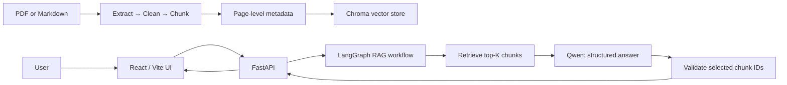

# PolicyRAG Studio

> 一个面向保险产品资料的、可追溯证据的 RAG（Retrieval-Augmented Generation）知识库问答系统。

PolicyRAG Studio 将 PDF 或 Markdown 产品资料纳入可管理的本地知识库，支持基于资料的问答、具体到原始 PDF 页码的引用，以及切块与 metadata 的可视化核查。项目聚焦一个真实企业知识库场景：回答不仅要“像是对的”，还必须让用户能够回到原始资料验证依据。

> **Portfolio MVP**：项目可在本地完整运行，适合展示 RAG 应用、文档治理与可验证问答的工程思路。真实保险文档、向量库与 API 密钥均不包含在仓库中。

## Highlights

- **Evidence-first answering**：仅使用本次检索到的资料作答；若证据不足，系统明确拒答，而非猜测。
- **Verifiable page citations**：引用由 chunk metadata 程序化生成，精确到源文件与 PDF 页码；前端可一键打开对应页面。
- **Document lifecycle management**：支持 PDF / Markdown 上传、启用、停用、下架与处理状态展示。
- **Inspectable chunking**：在知识库管理页查看每个 chunk 的正文、页码、chunk 序号和 metadata，用于人工检查切块质量。
- **Retry-aware retrieval**：通过 LangGraph 管理检索流程；初次证据不足时仅改写查询并重试一次，避免无限循环。
- **Privacy-conscious local storage**：原始资料、清洗结果、SQLite 文档目录和 Chroma 向量库只存放在本机，默认由 Git 忽略。

## Product flow



## How it works

### 1. Ingest and govern documents

1. Upload a PDF or Markdown file from the knowledge-base page.
2. Enable the document to run the local processing pipeline:
   - PDF native-text extraction with **PyMuPDF** (or normalization for Markdown)
   - conservative Markdown cleanup with a per-page report
   - page-bounded chunking with overlap
   - embedding and persistence to **Chroma**
3. Inspect generated chunks before using the document as a knowledge source.
4. Disable or delete a document to remove it from retrieval.

Each chunk carries reproducible metadata including `source_file`, `page`, `chunk_index`, and `cleaning_version`. Chunks never cross a PDF page boundary, which keeps citations unambiguous.

### 2. Answer with traceable evidence

For every question, the application:

1. Embeds the query and retrieves the most relevant chunks from Chroma.
2. Requests a structured answer from Qwen using only the retrieved context.
3. Requires the model to select supporting `chunk_id` values.
4. Validates that those IDs are actually from the current retrieval result.
5. Generates page references from trusted metadata, not from model-generated text.

If evidence is insufficient, LangGraph may rewrite the *search query* once and retrieve again. It never retries indefinitely; after two attempts, the system returns a grounded refusal.

## Tech stack

| Layer | Technologies | Responsibility |
| --- | --- | --- |
| Frontend | React 19, Vite | Chat, knowledge-base management, chunk inspection, PDF navigation |
| API | FastAPI, Pydantic | Typed HTTP interface and document-management endpoints |
| RAG orchestration | LangChain, LangGraph | Retrieval, structured output, conditional retry workflow |
| Models | DashScope / Qwen OpenAI-compatible API | `qwen-plus`, `qwen-turbo`, `text-embedding-v3` |
| Vector database | Chroma | Local embedding persistence and similarity retrieval |
| Document processing | PyMuPDF, Markdown | Native PDF text extraction, cleanup, page-aware chunks |
| Local metadata | SQLite | Document catalogue, status and processing counts |

## Getting started

### Prerequisites

- Python 3.12+
- [uv](https://docs.astral.sh/uv/)
- Node.js 20+
- A DashScope API key with access to the Qwen models above

### 1. Configure the backend

```bash
git clone https://github.com/abbyu120511/PolicyRAG.git
cd PolicyRAG

uv sync
cp .env.example .env
```

Edit `.env` and add your own key:

```dotenv
DASHSCOPE_API_KEY=your_dashscope_api_key
```

Start the API:

```bash
uv run uvicorn ragapp.api:app --reload
```

The OpenAPI interface is available at <http://127.0.0.1:8000/docs>.

### 2. Start the frontend

In a second terminal:

```bash
cd frontend
npm install
npm run dev
```

Open the address printed by Vite (normally <http://localhost:5173>). Upload a document in **Knowledge Base**, then enable it before asking questions in **Chat**.

### 3. Local quality checks

```bash
# Frontend
cd frontend
npm run build
npm run lint

# Backend (run from repository root)
uv run python -m compileall -q ragapp
```

## Repository structure

```text
PolicyRAG/
├── frontend/                  # React interface
├── ragapp/
│   ├── api.py                 # FastAPI endpoints
│   ├── document_manager.py    # Upload, enable, disable, delete, chunk preview
│   ├── pdf_to_markdown.py     # PDF → page-marked Markdown
│   ├── clean_markdown.py      # Conservative cleanup and reports
│   ├── index_markdown.py      # Page-aware chunking and Chroma indexing
│   ├── rag_chat.py            # Structured, grounded answer chain
│   └── langgraph_rag.py       # Conditional retrieve → answer → retry graph
├── private_docs/              # Local source documents (ignored; .gitkeep only)
├── storage/                   # Local vectors and processing artifacts (ignored)
└── docs/                      # Architecture and learning notes
```

## Data handling and security boundary

- Do **not** commit `.env`, customer documents, product PDFs, embeddings, or vector-store files.
- `private_docs/` and `storage/` are intentionally ignored by Git. Only empty `.gitkeep` placeholders are tracked.
- Enabling a document sends its chunks to the configured embedding provider. Querying sends the user question and retrieved chunks—not the entire source PDF—to the configured chat model.
- This MVP accepts files locally and has no authentication, tenancy or role-based access control. Do not deploy it with real enterprise data as-is.

## Current scope and production roadmap

The project deliberately keeps its first version small and inspectable. A production deployment would add:

- cloud object storage, PostgreSQL and a managed vector database
- SSO, role-based permissions, audit logs and tenant isolation
- asynchronous document jobs with queueing, retries and OCR fallback for scanned PDFs
- observability and evaluation: traces, retrieval/answer metrics, human review sets and regression tests
- rate limiting, secret management, CI/CD and automated API / UI testing

## Project notes

For a deeper walkthrough of the design decisions, LangChain / LangGraph workflow, Python concepts and troubleshooting lessons, see [Project Handbook](docs/policyrag_project_handbook.md). The repository also retains a few small LangChain learning scripts from the project build-up; the product implementation lives in `ragapp/` and `frontend/`.

## License

This repository is provided for portfolio and learning purposes. Before reusing it in a commercial setting, add a suitable license and complete the production safeguards listed above.
